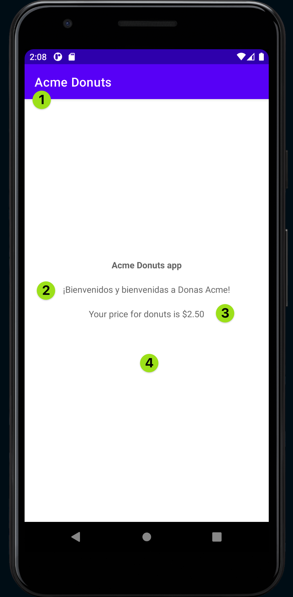
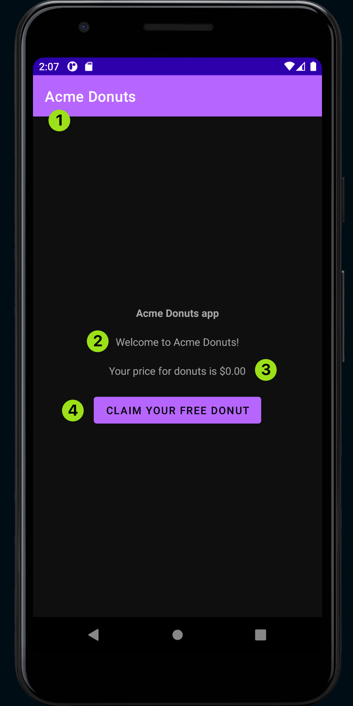

# Android Java example: Acme Donuts

- [About](#about)
- [Public user](#public-user)
- [Employee user](#employee-user)
- [More Examples](#more-examples)

## About

This app has 2 modes, one for regular/public users and one for employee users.

The GrowthBook SDK is implemented in the following ways:

- Initialize the GrowthBook SDK in a custom `Application` class using the `features.json` file from disk, which is the format that the SDK Endpoints returns.
- Set the user attributes in the `MainActivity`'s `initUser()` function. Here you can modify the code to choose a different user. See the `UserRepository` for details about the user attributes returned.
- Evaluates whether dark mode should be enabled, a boolean value. The feature evaluates to 50% of logged in users should see dark mode, so in this example, employee users will see dark mode.
- Evaluates the donut price, a float value. Users that are employees see a price of $0.00 (because employees get free donuts)
- Custom welcome text is returned based on the country of the user. 
- We are toggling UI elements (a `"Claim Free Donut"` button) depending on the evaluated price of the donut. For users where the donut price evaluates to `0.0f` they would see this button.

## Public user

When the regular user is chosen, the following UI changes occur:

1. UI mode is light mode because the feature `dark_mode` evaluates to false
2. Public users are hardcoded to `"spain"` and will see Spanish banner text.
3. Public users will see a donut price of $2.50 because the value returned by GrowthBook is `2.5f`
4. Public users will not see a button

## Employee user

1. UI mode is dark mode because the feature `dark_mode` evaluates to true
2. Employee users are hardcoded to `"canada"` and will see the default banner text specified in the GrowthBook dashboard.
3. Employee users will see a donut price of $0.00 because the value returned by GrowthBook is `0.0f`
4. Employee users will see a `"Claim Free Donut"` button

## More Examples

For a related example, see the [JVM example](https://github.com/growthbook/examples/tree/main/jvm-spring-web), which also includes a networking example.