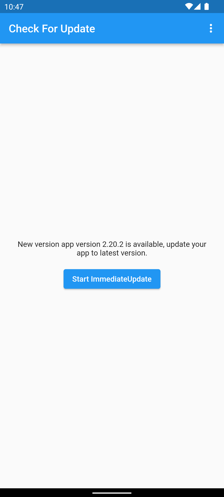
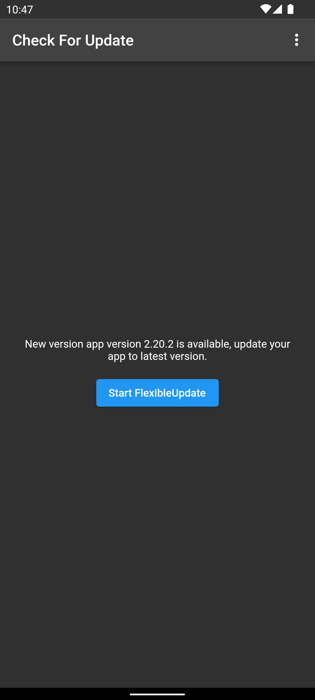
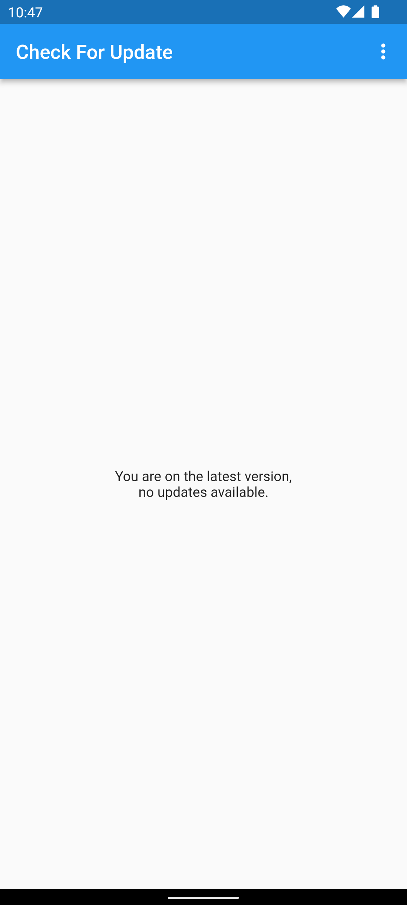

# example

## Attributes:

- User:
  - `buildNumber`: The build number of user's app.
  - `roles`: Role of user. One user can have more than one role from `admin`, `user` and `tester`.


## Brief Info about example:

- This project provides two examples:
  1. How to prompt a user to update their app, based on the current `buildNumber` and the `role` of the user by evaluating condition against the `buildNumber` and the `roles` of the user. In this example we have considered the latest app version as greater than 20.
     - If user is running app which have `buildNumber` less than 10 and if user contains role of the `tester`, then we will push an `immediate` update to user.
     - If user is running app which have `buildNumber` less than 10 and if user doesn't contains the role of the `tester` then we will push and `flexible` update to user.
     - If user is on the version which have `buildNumber` greater than 10, then will show text on on the screen that user is on the latest version.
  2. How to serve a user dark theme based on the role of the user.
     - If user have `role` of `admin` then we will set theme of the app as dark theme.


## User view and user attributes: 

<table>
  <tr>
    <th>User View</th>
    <th>Attributes</th>
  </tr>

  <tr>
    <td>
      
    </td>
<td>

```json
{
    "buildNumber": 10,
    "roles": [
      "user",
      "tester"
    ],

}
```
</td>
  </tr>
  <tr>
      <td>
      
    </td>
<td>

```json
{
    "buildNumber": 10,
    "roles": [
      "user",
      "admin"
    ],

}
```
</td>
  </tr>
  </tr>
  <tr>
      <td>
      
    </td>
<td>

```json
{
    "buildNumber": 20,
    "roles": [
      "user",
      "tester"
    ],

}
```
</td>
  </tr>
</table>


